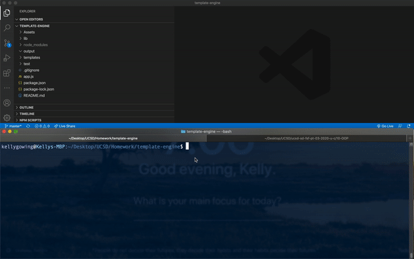
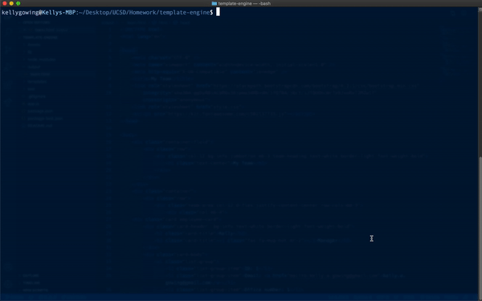

# Unit 10 OOP Homework: Template Engine - Employee Summary

## Project Preview




## Project Goals

Create a software engineering team generator command line application. The application will prompt the user for information about the team manager and then information about the team members. The user can input any number of team members, and they may be a mix of engineers and interns.

## User Story

```
As a manager
I want to generate a webpage that displays my team's basic info
so that I have quick access to emails and GitHub profiles
```
## Tests

This application has no known bugs



## Future Development

* Use validation to ensure that the information provided is in the proper expected format.

* Add the application to my portfolio.

- - -
© 2019 Trilogy Education Services, a 2U, Inc. brand. All Rights Reserved.
